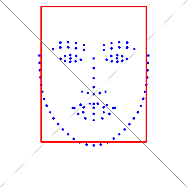

# Face Alignment

## 平均脸和平均矩形框的关系




## 数据集

为了训出精准鲁邦的人脸对齐模型, 需要足够多且多样的数据, 这里汇总了现在学术界及竞赛用到的一些公开的数据集:

### IBUG 数据集

由四个子集组成, 外加一个检测框标注

- i-bug: https://ibug.doc.ic.ac.uk/download/annotations/ibug.zip
- afw: https://ibug.doc.ic.ac.uk/download/annotations/afw.zip
- helen: https://ibug.doc.ic.ac.uk/download/annotations/helen.zip
- lfpw: https://ibug.doc.ic.ac.uk/download/annotations/lfpw.zip
- bounding box annotations: https://ibug.doc.ic.ac.uk/media/uploads/competitions/bounding_boxes.zip

数据集组织如下:
```
unzip ibug.zip -d ibug
mv ibug/image_092\ _01.jpg ibug/image_092_01.jpg
mv ibug/image_092\ _01.pts ibug/image_092_01.pts

unzip afw.zip -d afw
unzip helen.zip -d helen
unzip lfpw.zip -d lfpw
unzip bounding_boxes.zip ; mv Bounding\ Boxes Bounding_Boxes
```

## [WFLW](https://wywu.github.io/projects/LAB/WFLW.html)

WFLW 数据集总共标注了10000个人脸, 其中7500作为训练集,2500作为测试. 图像来自WIDER FACE 人脸检测数据集

## LaPa-Dataset for face parsing

- [Home Page](https://github.com/JDAI-CV/lapa-dataset)
- Dataset: [Google Drive](https://drive.google.com/file/d/1XOBoRGSraP50_pS1YPB8_i8Wmw_5L-NG/view?usp=sharing) | [Baidu Netdisk](https://pan.baidu.com/s/10GDmsmJJ28ugEJzj5Mu9gQ) password: LaPa

数据用于人脸解析比赛, 其中包含了人脸106点标注

## The 2nd Grand Challenge of Facial Landmark Localization 

- [Home Page](https://fllc-icpr2020.github.io/home/)
- Dataset:  [Baidu](https://pan.baidu.com/s/10jLmWAXRzZ2tN1oRef7Fug), password: ttlp; [Google Drive](https://drive.google.com/file/d/16fiVoBaTtOevQa4mH34rWggfkNKNEL2A/view?usp=sharing)

## The 1st Grand Challenge of 106-p Facial Landmark Localization

- [Home Page](https://facial-landmarks-localization-challenge.github.io/#index)
- Dataset: [Baidu](https://pan.baidu.com/s/1Sma_Lv_y-DtrXgDblYTucA); [Google Drive](https://drive.google.com/uc?id=1gD4xcUUKQo6-70KgBUbODSdQtb_tnuvu&export=download)
- Correct Annotation: [Download](https://github.com/facial-landmarks-localization-challenge/facial-landmarks-localization-challenge.github.io/blob/master/Corrected_landmark.zip?raw=true)